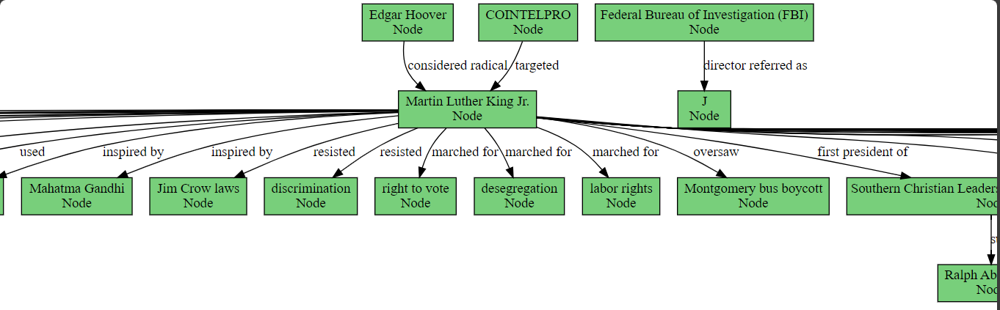

# LLM-Enhanced Knowledge Graph Construction & Question Answering

This repository explores various strategies for building Knowledge Graphs (KGs) using Large Language Models (LLMs), optimizing their performance in Question Answering (QA) tasks, and evaluating the impact of different techniques such as few-shot prompting and fine-tuning.

## Table of Contents
1. [Introduction](#introduction)
2. [Contextual KG Construction: Chunking and Fact Extraction](#contextual-kg-construction-chunking-and-fact-extraction)
3. [Effect of Few-Shot Prompting](#effect-of-few-shot-prompting)
4. [Fine-Tuning for KG Formatting](#fine-tuning-for-kg-formatting)
5. [Vector Databases vs KGs for QA](#vector-databases-vs-kgs-for-qa)
6. [Source Tracking in QA](#source-tracking-in-qa)
7. [How to Use](#how-to-use)
8. [Installation](#installation)
9. [Contributions](#contributions)
10. [License](#license)

---

## Introduction
In this project, we investigate methods for leveraging LLMs to construct Knowledge Graphs (KGs) and perform accurate Question Answering (QA). The goal is to refine KG extraction techniques while evaluating the trade-offs between KGs and vector databases for storing and querying knowledge. We also explore approaches to track the origin of facts within the context used for KG creation.


## Contextual KG Construction: Chunking and Fact Extraction
This section details the normal approach for extracting facts from the entire context using LLMs to build KGs. Before the extraction, we go through a first pre-processing step: chunking and fact extraction. The context is divided into chunks and facts are extracted individually from each chunk before being integrated into the KG. This method aims to improve precision by focusing on smaller, more manageable text units.

We use the `breakdown_answer` function to divide our text into a list of facts.  Then we use the following prompt to extract the Knowledge Graph:
```bash
prompt = ChatPromptTemplate.from_messages(
        [(
          "system",prompting
),
            ("human",  "Use the given format to extract information from the following list of facts. If there are any dates or numbers, do not forget them in the nodes and relationships: {input}"),
            ("human","Tip: Make sure to answer in the correct format. Don't forget the numbers in your extraction of nodes and relationships. Include them as relationships, not proprieties"),
        ])
```
The Knowledge Graph's extraction and the facts extraction's codes are in the `base_query.py` file. `Querying.ipynb` contains an example of how to run the KG extraction and how to query it for answers. 

<p align="center">
  
</p>

The full knowledge graph extracted from the first page of `mlk.pdf` is in `output.png`.
## Effect of Few-Shot Prompting
Few-shot prompting is critical in improving the precision of KG extraction. This section analyzes the effect of providing relevant examples in the prompt to guide the LLM's fact extraction process. Experiments compare results with and without few-shot prompting to assess the impact on KG accuracy.
We start by building our few_shots examples. First, we build a list of facts extracted from random wikipedia pages. This is an example:
```bash
abraham_lincoln_facts = [
    "Abraham Lincoln served as the 16th President of the United States, from 1861 to 1865.",
    "He led the country through its Civil War, preserved the Union, and ended slavery with the Emancipation Proclamation.",
    "Lincoln delivered the Gettysburg Address on November 19, 1863, one of the most famous speeches in American history.",
    "He was born in a log cabin in Hardin County, Kentucky, on February 12, 1809, and grew up in a poor family.",
    "Lincoln was largely self-educated and became a successful lawyer before entering politics.",
    "He was assassinated by John Wilkes Booth at Ford's Theatre in Washington, D.C., on April 14, 1865.",
    "Lincoln's leadership and statesmanship have made him one of the most revered presidents in U.S. history.",
    "He is often referred to as 'Honest Abe' due to his reputation for integrity and honesty.",
    "Abraham Lincoln was 6 feet 4 inches tall, making him the tallest U.S. president."
]
```
We then call the `get_extraction_chain` on it. More details are in: `few_shots_prompts.py`.
The following is a comparison showing how the few_shots prompting improves the knowledge graph extraction:
| Model               | # Nodes | # Relationships | Latency (s) |
|:-------------------:|:-------:|:---------------:|:-----------:|
| GPT4 zero-shot       |   19    |       17        |    45.59    |
| GPT4 1-shot          |   26    |       26        |    49.36    |
| GPT4 2-shot          |   27    |       22        |    51.65    |
| GPT4 3-shot          |   17    |       17        |    49.61    |
| GPT3.5 zero-shot     |   15    |       11        |    37.5     |
| GPT3.5 1-shot        |   22    |       18        |    16.95    |
| GPT3.5 2-shot        |   14    |       12        |    16.20    |
| GPT3.5 3-shot        |   24    |       22        |    18.35    |


## Fine-Tuning for KG Formatting
LLMs like Llama2 and Mistral often face challenges when parsing generated outputs into a structured Knowledge Graph (KG) format, such as nodes and relationships. To address this issue, we fine-tuned these models using a synthetic dataset consisting of 200 examples, generated with GPT-4. This fine-tuning significantly improved their ability to format outputs into a structured KG format.

## Vector Databases vs KGs for QA
This section explores the trade-offs between using vector databases and traditional KGs for answering questions. We compare their respective advantages in terms of retrieval speed, answer accuracy, and scalability when used for QA tasks.
We use for this purpose the [SQUAD dataset](https://huggingface.co/datasets/rajpurkar/squad). First, we query both the database and the knowledge graph to retrieve potential answers. These answers, along with a baseline answer, are then embedded using the TF-IDF vectorizer. To evaluate the similarity between each retrieved answer and the baseline, we compute the cosine similarity between their respective embeddings.

```bash
from sklearn.feature_extraction.text import TfidfVectorizer
from sklearn.metrics.pairwise import cosine_similarity

def calculate_similarity(sentence1, sentence2):
    # Initialize TfidfVectorizer
    vectorizer = TfidfVectorizer()

    # Fit and transform the sentences
    tfidf_matrix = vectorizer.fit_transform([sentence1, sentence2])

    # Calculate cosine similarity
    cosine_sim = cosine_similarity(tfidf_matrix[0], tfidf_matrix[1])

    return cosine_sim[0][0]

# Example sentences
sentence1 = answers[0][0]
sentence2 = answers[0][2]
sentence3 = answers[0][1]
# Calculate similarity
similarity_score1 = calculate_similarity(sentence1, sentence2)
similarity_score2 = calculate_similarity(sentence1, sentence3)
print(similarity_score2, similarity_score1)
```

## Source Tracking in QA
In addition to providing answers, we also implement a method for tracing the paragraph or section of the original context that provided the extracted information. This bonus feature enhances transparency by linking each fact to its source within the input text.
First, we divide the original context text into paragraphs: 
```bash
def divide_into_paragraphs(text, lines_per_paragraph=4):
    lines = text.split('.\n')
    paragraphs = []
    current_paragraph = []

    for line in lines:
        current_paragraph.append(line + '.')
        if len(current_paragraph) == lines_per_paragraph:
            paragraphs.append('\n'.join(current_paragraph))
            current_paragraph = []

    if current_paragraph:
        if len(lines) % lines_per_paragraph < lines_per_paragraph // 2 + 1 and paragraphs:
            paragraphs[-1] += '\n' + '\n'.join(current_paragraph)
        else:
            paragraphs.append('\n'.join(current_paragraph))

    return paragraphs
```
Then perform a similarity measure:
```bash
from sklearn.feature_extraction.text import TfidfVectorizer
from sklearn.metrics.pairwise import cosine_similarity
import numpy as np

# Concatenate true facts and paragraphs
paragraphs = divide_into_paragraphs(user_context)
trues = true_facts(answer_chunks, fact_statuses)
list_text = trues + paragraphs

# Compute TF-IDF vectors for the texts
tfidf_matrix = TfidfVectorizer().fit_transform(list_text)

# Calculate cosine similarity for each true fact against the paragraphs
for idx, fact in enumerate(trues):
    similarity_scores = cosine_similarity(tfidf_matrix[idx], tfidf_matrix[len(trues):])
    paragraph_ind = np.argmax(similarity_scores)
    print(f"The truthness of the fact --{fact}-- was asserted using paragraph -{paragraph_ind}-.")
```
The following is an example of the output:

the truthness of the fact --- Martin Luther King Jr was named Michael King at birth-- was asserted using paragraph -0- of the paragraphs list
the truthness of the fact --- Martin Luther King Jr was an African-American pastor-- was asserted using paragraph -0- of the paragraphs list
the truthness of the fact --- He was inspired by Mahatma Gandhi-- was asserted using paragraph -0- of the paragraphs list
the truthness of the fact --- He started a civil rights movement in the USA-- was asserted using paragraph -1- of the paragraphs list
the truthness of the fact --- He led movements in Albany-- was asserted using paragraph -1- of the paragraphs list
the truthness of the fact --- He led movements in Birmingham-- was asserted using paragraph -1- of the paragraphs list
the truthness of the fact --- He was killed before he turned 40-- was asserted using paragraph -2- of the paragraphs list
the truthness of the fact --- He was awarded the Nobel Peace Prize-- was asserted using paragraph -2- of the paragraphs list

